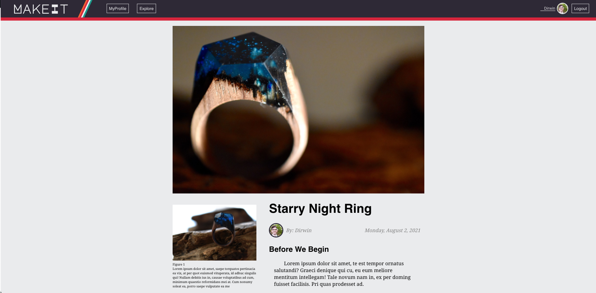
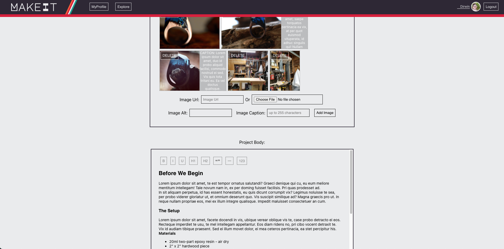
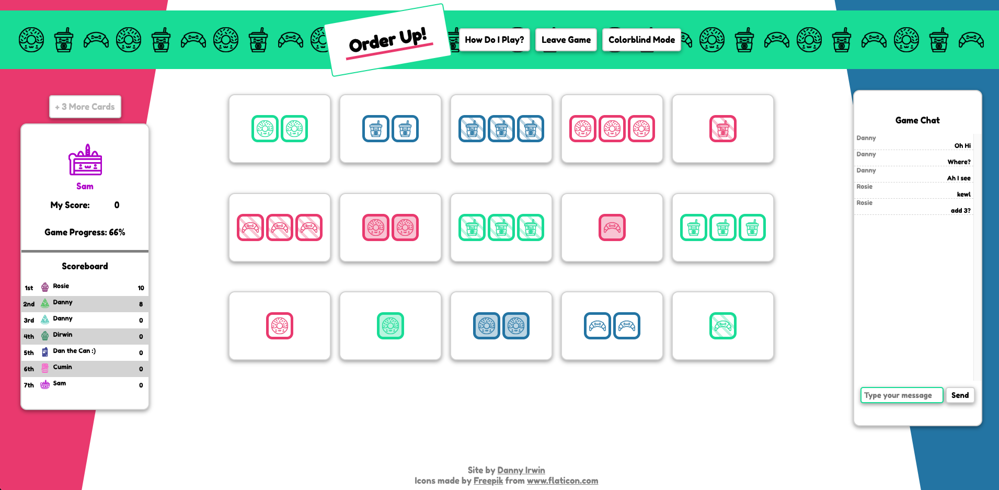

</img>

### Why, Hello!

My name is Danny Irwin and I am a full-stack web developer and recent graduate from
the Flatiron School Software Developer immersive.

I've been coding as a hobby since 2017 and decided to get serious about making
the professional transition in 2020. Prior to that, my formal training and
career was in the performing arts. I've worked as a professional actor all over
the east coast and on national tours, as well as working as a vocal and music
director and a variety of other positions with theatre companies. I also have a
robust professional background in high volume customer service and client-facing
positions.

<!-- <a href="https://www.youtube.com/watch?v=nCd9MCMyegY"> Want to see me perform a
little? Click here. </a>_ -->

I am a passionate person who loves to throw himself into new challenges. I am
excited to not only learn how to make code work, but how to make it work well. I
work from a top down approach to build applications that focus first on
seamlessly serving the users' needs and keeping their experience at the
forefront.

Get in touch: dirwin123@gmail.com

<a href="https://www.linkedin.com/in/itsdanielirwin/"></img></a>
<a href="mailto:dirwin123@gmail.com"></img></a>

### Technical Proficiencies

JavaScript // React // HTML // CSS // jQuery // RESTful APIs // GitHub // Linux CLI // Node // Express // Ruby // Rails // Redux // TypeScript // p5 // Unreal Engine

### Portfolio Snapshot

#### MakeIt

MakeIt is a publishing and community network for makers, artist, and creatives of all skill levels.

It was a fantastic learning chance to learn a whole new tech stack.  For this project, I learned Redux and a fun Node/Express/Knex/Objection stack, image hosting using firebase, and fully deployed on firebase and heroku.  It also incorporates full Auth. It uses rich text editing with Draft.js and the front end was built using React.

[Video Demo](https://www.youtube.com/watch?v=ctDpw4tNPwM&ab_channel=DanielIrwin)

[Check it out HERE](https://makeit-e985d.web.app/)

</img>

</img>

#### Order Up!

Order Up is an online multiplayer game based on the popular card game, Set.

The front end is built using React for the frontend and a Ruby on Rails backend with ActionCable to handle WebSockets.  It includes live games and in-game chat, avatar customization, and matchmaking. The backend is deployed using Heroku.

[Video Demo](https://youtu.be/wMUJNUr6iXg)

[Check it out HERE](https://dannyirwin.github.io/order-up-frontend/)

</img>

#### Orbital Physics Simulator

Before starting with Flatiron School, I did some learning on my own. This
project loosely simulates the movements of celestial bodies in space and was
heavily influenced by my reading The Three Body Problem at the time. It was
built using only vanilla HTML CSS and JavaScript.

[Video Demo](https://youtu.be/iZnxW0VS7Z8)

[Check it out HERE](https://dannyirwin.github.io/Orbital-Physics/)

</img>

#### Sightless

When the COVID-19 pandemic began, my friend and coding mentor decided to pick up
a personal project together. Sightless is a VR game for Oculus built in Unreal
Engine. It is an experiment about navigating a VR gamespace using only haptic
and audio feedback. No visuals whatsoever. Taking on the Junior Developer role,
I got to get my hands on some fantastic new technologies. I largely focused on
building audio features: playing with collision and enemy sounds and attenuation
to dictate location, and composing and implementing dynamic music to indicate
distance to objectives

Sightless is currently under review on the oculus store.

Some concept art for the logos:

<<<<<<< HEAD
#### SampL

During the bootcamp, I found myself building countless little apps to practice
new front end development techs. It became helpful for me to be able to very
quickly add some boilerplate styling. The idea for this tool came out of the
need to quickly find and add a color palette to these little projects. The user
can input an Image Url from the web and SampL will extract six of the most
vibrant colors, provide their HEX value in a preview, and change the coloring of
the page to match that palette. The user can save, remove, and view palettes
using json-server backend.

[Check it out (without the backend) HERE](https://dannyirwin.github.io/phase-2-group-project/)

</img>

